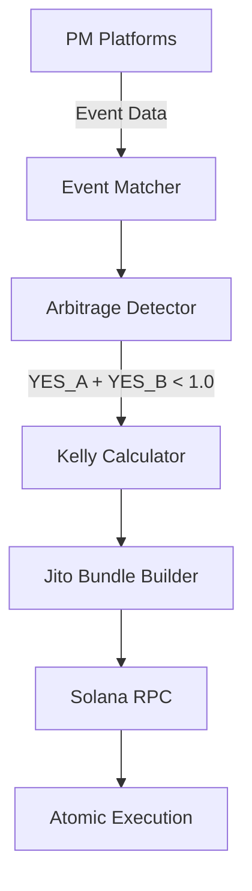

<p align="center">
  
</p>

<p align="center">
  <a href="https://thrsh.fun">
    
  </a>
  <a href="https://twitter.com/thrshfun">
    
  </a>
  <a href="https://github.com/thrsh-fun/thrsh/actions/workflows/ci.yml">
    
  </a>
  
</p>

<p align="center">
  <strong>Cross-market prediction market arbitrage engine for Solana.</strong><br/>
  Separate the wheat from noise.
</p>

---

## Key Features

| Feature | Description |
|---------|-------------|
| Cross-Platform Matching | Pairs identical events across Polymarket, Drift, Hedgehog, and MetaDAO |
| Arbitrage Detection | Identifies price gaps where YES_A + YES_B < 1.0 across platforms |
| Kelly Criterion Sizing | Calculates optimal position sizes using full and fractional Kelly |
| Atomic Execution | Bundles trades via Jito for MEV-protected atomic settlement |
| Real-Time Scanning | Continuous market monitoring with configurable staleness thresholds |
| On-Chain State | All positions and match history stored on Solana for transparency |

## Architecture



## Installation

```bash
git clone https://github.com/thrsh-fun/thrsh.git
cd thrsh
anchor build
```

Build the CLI:

```bash
cargo build --release -p thrsh-cli
```

Build the TypeScript SDK:

```bash
cd sdk
yarn install
yarn build
```

## Usage

### CLI

Scan markets for matching events:

```bash
thrsh scan --min-liquidity 1000000000 --max-staleness 60
```

Detect arbitrage opportunities:

```bash
thrsh detect --min-yield-bps 50
```

Execute a harvest:

```bash
thrsh harvest --match-id <hex> --amount 500000000
```

### SDK

```typescript
import { ThrshClient } from "@thrsh/sdk";
import { Keypair } from "@solana/web3.js";
import { Wallet } from "@coral-xyz/anchor";
import BN from "bn.js";

const wallet = new Wallet(Keypair.generate());
const client = new ThrshClient("https://api.mainnet-beta.solana.com", wallet);

const scanResult = await client.scanMarkets({
  minLiquidity: new BN(1_000_000_000),
  maxSpreadBps: new BN(500),
  stalenessThreshold: new BN(60),
});

for (const match of scanResult.matches) {
  const detection = await client.detectArbitrage(match, 50);
  if (detection) {
    console.log("Yield:", detection.opportunity.yieldEst.toString(), "bps");
  }
}
```

## Tech Stack

| Layer | Technology |
|-------|-----------|
| Smart Contracts | Rust / Anchor 0.30 |
| Math Library | Rust (fixed-point arithmetic) |
| SDK | TypeScript / @solana/web3.js |
| CLI | Rust / Clap 4 |
| CI/CD | GitHub Actions |
| Runtime | Solana 1.18 |
| Bundle Execution | Jito |

## License

MIT -- see [LICENSE](./LICENSE) for details.
